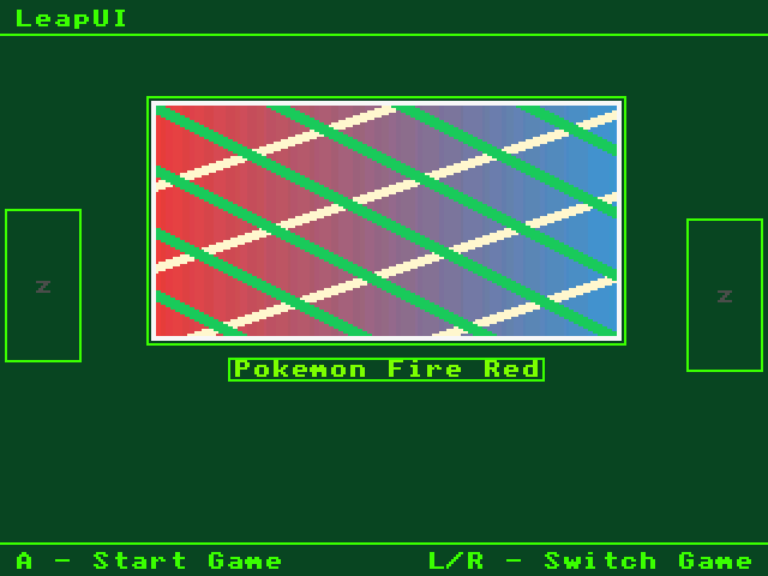

# LeapUI



**LeapUI** is a small **GBA-only frontend core** (libretro) for **NocturnalRTOS / DartOS**
handhelds — SF2000, GB300, DY19. It builds on FrogUI's libretro wrapper and `core_api`,
and pairs it with a Slot-style carousel shelf: scan the GBA library, browse games with
box art, launch through **gpSP**.

One device core (`leapui.mars`) runs on all three handhelds; the OS only differs in
joypad/LCD init and detects that at runtime.

## Quick start

```bash
make pc -j4      # PC test core  -> build/unix/leapui_libretro.so
make gb300 -j4   # device core   -> build/dartos/leapui.mars  (+ .hcrtos)
```

`make gb300` needs the MIPS toolchain — run `make toolchain` once (~150 MB into
`./x-tools`). On Windows run everything through **WSL**. Full details below.

## Download the core (GitHub Actions)

No toolchain, no build needed — grab the prebuilt device core from CI:

1. Open the repo's **Actions** tab and click the **build-leapui** workflow.
2. Pick the latest green run (top of the list) and scroll to the **Artifacts** box.
3. Download the `leapui-<commit-sha>.zip`, which contains:
   - `leapui.mars` + `leapui.hcrtos` — the **device core** (identical files)
   - `leapui_libretro.so` — PC test build
   - `_libretro_dartos.a`, `core.elf.map` — build intermediates
4. Unzip it and copy `leapui.mars` to the SD card — then follow
   [Installing on a device](#installing-on-a-device).

Notes:

- A fresh artifact is built on every push to `main`, on pull requests, and on
  demand via the **Run workflow** button (workflow_dispatch).
- Downloading artifacts requires a **GitHub login**.

## Features

- **Library scan** — reads `ROMS/Game Boy Advance/` **recursively** (subfolders
  are flattened into one shelf, up to **1024** games); falls back to `ROMS/` when
  that folder is missing or empty.
- **Carousel UI** — `200x104` center banner whose `196x100` image area matches the
  real GBA cart sticker ratio (43:22). Box art is **fitted without distortion**;
  `0x0000` pixels are drawn transparent so rounded-corner art blends into the UI.
- **Motion** — blinking banner border, 1 px slide on scroll, gently bobbing side
  previews, springy smooth scrolling; all 8×8 text uses the bundled bitmap font
  (no external font file, core stays < 60 KB).
- **Controls** — `L/R` (or `LEFT/RIGHT`) browse the shelf · `A` start / resume
  (gpSP save state) · hold `A` 500 ms for a clean boot · `SELECT`/`START` shows
  the About screen.
- **Resume** — remembers the last game (`last_cart.txt`) and restores it on boot.
- **Theme** — parses `system/assets/LeapUI/theme.txt` (Slot-style `housing`,
  `recess`, `opening`, `edge` keys + hex colors); the active palette is defined
  in `src/render.h`.
- **Logging** — writes `system/logs/leapui.log` (next to the firmware log) with
  `shelf_scan`, `queue_insert`, `ROM/CORE check` and `RUN_EMULATOR` entries for
  on-device diagnostics.

## Repository layout

```
src/leapui.c               core entry: init, scan trigger, run-game queue, launch check
src/shelf.c                recursive .gba scan + carousel state (MAX_ROMS = 1024)
src/render.c               backdrop/header/footer, banner, side previews, box art
src/font.c                 8x8 bitmap ASCII font (self-contained)
src/theme.c                theme.txt parser
src/fallback_functions.c   RUN_EMULATOR launch path (dartos.h)
src/core_api.c             stock Argent-Cores API glue     — DO NOT EDIT
src/frontend_functions.c   stock Argent-Cores loader glue  — DO NOT EDIT
include/                   headers: leapui.h, shelf.h, libretro.h, dirent.h shim
tools/                     smoke-test harness + PNG/.res converters (see "Testing")
build/                     generated artifacts (gitignored): build/unix, build/dartos
.github/workflows/         CI: builds device + PC cores, uploads them as artifacts
```

## Building

### Requirements

- Linux/macOS, or **WSL** on Windows (the toolchain and CI are Linux-based).
- `make`, a C compiler for the PC build, `curl` or `wget` for the toolchain download.
- Device build needs the `mipsel-mti-elf` GCC toolchain
  (frog-toolchain, bare-metal newlib) — auto-downloaded by `make toolchain`.

### Commands

| Target | Produces | Notes |
|---|---|---|
| `make pc` | `build/unix/leapui_libretro.so` | PC smoke tests, needs only `gcc` |
| `make gb300` | `build/dartos/leapui.mars` + `.hcrtos` | device core; requires toolchain |
| `make toolchain` | `./x-tools/` | downloads frog-toolchain once (~150 MB) |
| `make docker` | device core | builds in an alpine container, no toolchain install |
| `make install SDROOT=/path/to/sd` | SD card | copies core + writes config (see below) |
| `make check` / `make help` / `make clean` | — | environment info / usage / wipe `build/` |

- `pc` and `unix` are the same platform; `gb300` and `dartos` are the same
  platform (aliases kept for convenience).
- Bare `make` auto-detects: with a working MIPS toolchain it builds the device
  core, otherwise the PC core.
- Objects and artifacts are kept per platform under `build/<platform>/` so x86
  and MIPS objects never mix; `make clean` removes `build/`.

### On Windows (WSL)

```bash
wsl bash -lc 'cd "/mnt/c/Users/<you>/<path>/LeapUI" && make toolchain'
wsl bash -lc 'cd "/mnt/c/Users/<you>/<path>/LeapUI" && make gb300 -j4'
# artifacts: build/dartos/leapui.mars + leapui.hcrtos
```

## SD card layout

```
SD:/
  ROMS/Game Boy Advance/**/*.gba     <- scanned recursively (max 1024)
  ROMS/Game Boy Advance/.res/*.rgb565<- raw RGB565 box art (optional)
  ROMS/LeapUI/leap.ui                <- 0-byte boot-rom stub (loader boots LeapUI with it)
  system/Phobos/cores/leapui.mars    <- this core
  system/Phobos/cores/gpSP.mars      <- game core, from Argent-Cores (required)
  system/bios/gba_bios.bin
  system/assets/LeapUI/theme.txt     <- theme file (optional)
  system/configs/Phobos.opt          <- boot config: hcrtos_core_path = "leapui"
  system/configs/dartos.opt          <- legacy copy with the same key
  system/logs/leapui.log             <- written at runtime
```

## Installing on a device

1. Use an SD card flashed with NocturnalRTOS (Nocturnal branch) and mount it.
2. Install the core:

   ```bash
   make install SDROOT=/media/<user>/<SD>     # Linux
   make install SDROOT=/mnt/d                 # WSL
   ```

   This copies `leapui.mars` to `system/Phobos/cores/`, creates the **0-byte
   boot-rom stub** `ROMS/LeapUI/leap.ui` that the loader boots LeapUI with (it
   stays empty on purpose), and sets the **boot core** in
   `system/configs/Phobos.opt` (legacy `dartos.opt` too):
   `hcrtos_core_path = "leapui"`. Doing it by hand:

   ```bash
   cp build/dartos/leapui.mars "/<SD>/system/Phobos/cores/leapui.mars"
   mkdir -p "/<SD>/ROMS/LeapUI" && : > "/<SD>/ROMS/LeapUI/leap.ui"  # 0-byte stub
   # then set  hcrtos_core_path = "leapui"  in /<SD>/system/configs/Phobos.opt
   ```
3. **Boot core**: NocturnalRTOS starts the core named in
   `system/configs/Phobos.opt` (key `hcrtos_core_path`, stock value `frogui`).
   `make install` rewrites it to `leapui` while keeping every other setting —
   or edit it by hand:

   ```ini
   ; SD:/system/configs/Phobos.opt  (keep all other lines)
   hcrtos_core_path = "leapui"
   ```

   Without this, the stock FrogUI frontend boots instead of LeapUI.
4. Put **gpSP** on the card: `system/Phobos/cores/gpSP.mars` from Argent-Cores —
   the menu runs without it, but launching a game needs it.
5. Drop GBA ROMs into `ROMS/Game Boy Advance/`. Box art is optional — see below.
6. Boot the handheld. If a launch fails, check `system/logs/leapui.log`.

## Box art (.res)

- Location: `ROMS/Game Boy Advance/.res/<rom-name>.rgb565` — the file name must
  match the `.gba` file name.
- Format: raw **little-endian RGB565**. Accepted sizes: `64x64`, `128x128`,
  `160x160`, `200x200`, `250x200` (FrogUI standard) plus `196x100` (GBA sticker),
  `196x86`, `220x120`, `144x208`, `320x240`.
- Convert any PNG with the bundled tool (stdlib only, alpha-aware, resizes
  keeping the aspect ratio):

  ```bash
  python3 tools/png_to_res.py label.png label.rgb565 196 100
  cp "label.rgb565" "/SD/ROMS/Game Boy Advance/.res/Pokemon Fire Red.rgb565"
  ```

  Note: pixel value `0x0000` is drawn transparent by the renderer — fully opaque
  pure-black areas of an image will show the background through them.

## Testing on PC

No RetroArch needed:

```bash
bash tools/smoke_run.sh
```

Rebuilds both platforms, feeds fake ROMs to a minimal libretro frontend
(`tools/smoke_libretro.c`), exercises a full scan + one `A` press, and renders
the final frame to `tools/frame_ui.png` for eyeballing. Helper tools:

| Tool | Purpose |
|---|---|
| `tools/smoke_run.sh` | one-shot rebuild + sandbox + smoke test + frame dump |
| `tools/smoke_libretro.c` | minimal libretro frontend (also usable standalone) |
| `tools/rgb565_to_png.py` | RGB565 frame -> PNG (scaled) |
| `tools/png_to_res.py` | PNG box art -> `.rgb565` `.res` file |
| `tools/make_test_thumb.py` | generates a fake `.res` thumbnail |

## Development

- Custom logic lives in the core sources (`leapui.c`, `shelf.c`, `render.c`,
  `font.c`, `theme.c`). `core_api.c` / `frontend_functions.c` are stock
  Argent-Cores glue that must stay in sync with the loader — avoid editing them.
- `src/fallback_functions.c` owns the `RETRO_ENVIRONMENT_RUN_EMULATOR` launch
  path (`dartos.h`, `game_name_buf` / `core_name_buf`).
- The device build compiles against the bundled `include/dirent.h` shim; the PC
  build uses the host `<dirent.h>`.

## Credits

- **FrogUI** (Data-Frog-Central) — libretro wrapper + `core_api` + filesystem glue.
- **Slot** — the carousel/slot UX (L/R shelf, insert/eject, theme housing/recess).
- **Desoxyn** — author of **NocturnalRTOS**; debugged the core boot path by
  tracing `R31`/`$ra` in `core.elf`.
- **AxelGarciaK (axgdev)** — `RETRO_ENVIRONMENT_RUN_EMULATOR` + `dartos.h`
  integration and build guidance.
- **Freebuff (AI)** — coding agent used to build, test and tool this project.

## License

ISC — see [LICENSE](LICENSE).
